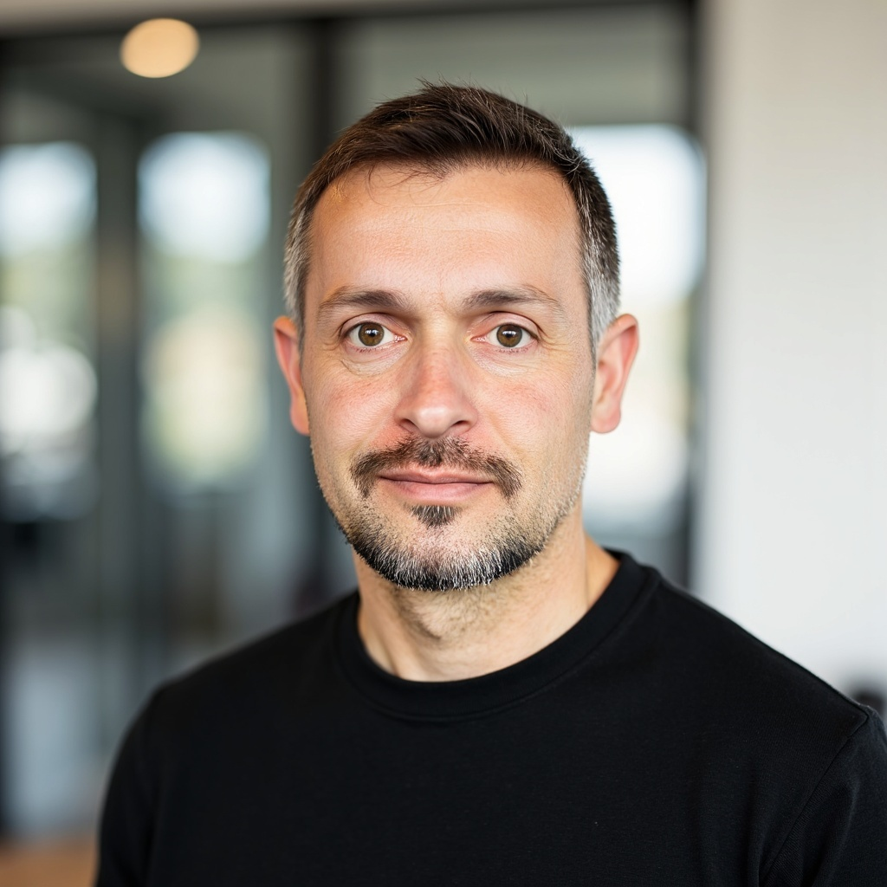

  

# Chaz Hyseni, Ph.D. {docsify-ignore}

> Spatial Eco-Evolutionary Genetics

> ORISE Postdoctoral Fellow  
> U.S. Forest Service  
> Aquatic Conservation & Ecology

  <a href="mailto:chaz.hyseni@gmail.com" style="margin: 0 10px;">?? Email</a>
  <a href="https://github.com/chazhyseni" style="margin: 0 10px;">?? GitHub</a>
  <a href="https://scholar.google.com/citations?user=i-4wi1oAAAAJ" style="margin: 0 10px;">?? Scholar</a>
  <a href="https://twitter.com/chazbvb09" style="margin: 0 10px;">?? Twitter</a>
  <a href="https://orcid.org/0000-0003-2567-8013" style="margin: 0 10px;">?? ORCID</a>

[Get Started](#about)
[Publications](#/publications)
[Download CV](files/cv.pdf ':ignore :target=_blank')