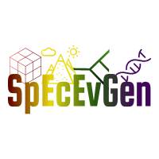

# Chaz Hyseni, Ph.D. {docsify-ignore}

> Spatial Eco-Evolutionary Genetics

> ORISE Postdoctoral Fellow  
> U.S. Forest Service  
> Aquatic Conservation & Ecology

[Email](mailto:chaz.hyseni@gmail.com)
[GitHub](https://github.com/chazhyseni)
[Google Scholar](https://scholar.google.com/citations?user=i-4wi1oAAAAJ)
[Twitter](https://twitter.com/chazbvb09)

[Get Started](#about)
[Publications](#/publications)
[CV](files/cv.pdf)
