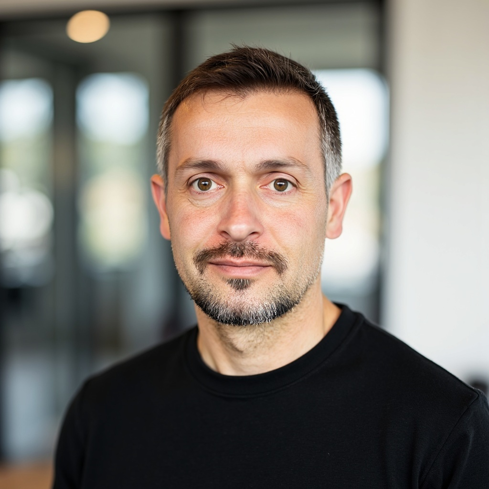

# About

  

    
  

  

    <h2 style="margin-top: 0;">Chaz Hyseni, Ph.D.</h2>
    
<strong>Senior Computational Scientist</strong> 
    Colossal Biosciences 
    Dallas, TX

    

      <a href="mailto:chaz.hyseni@gmail.com">📧 Email</a> | 
      <a href="https://github.com/chazhyseni">💻 GitHub</a> | 
      <a href="https://scholar.google.com/citations?user=i-4wi1oAAAAJ">📚 Google Scholar</a> |
      <a href="https://orcid.org/0000-0003-2567-8013">🆔 ORCID</a> |
      <a href="https://www.researchgate.net/profile/Chaz_Hyseni"><i class="fab fa-researchgate"></i> ResearchGate</a>
    

  

## Research Overview

I am a Senior Computational Scientist at Colossal Biosciences, where I apply **machine learning and deep learning methods** to determine the genetic underpinnings of phenotypic evolution across vertebrates. My work integrates **large language models adapted for DNA sequences** with evolutionary biology expertise to solve complex genotype-phenotype association problems in de-extinction research.

With 20 years of experience in molecular techniques and statistical analyses, I specialize in translating evolutionary biology questions into **machine learning frameworks**. My research leverages **TensorFlow, Keras, and PyTorch** pipelines for regulatory element prediction and cross-species genomic analysis, while developing novel algorithms that bridge evolutionary theory with modern AI approaches.

Throughout my career, I have used both empirical data and spatial eco-evolutionary modeling to understand genetic variation in natural environments. This includes implementing **genetic algorithms for optimization of resistance surfaces** in connectivity modeling, utilizing circuit theory-based approaches to map landscape corridors enabling species movement and population connectivity.

**Timescales of evolution** remains a unifying theme: at historical timescales, I examine geographic and environmental influences on DNA sequence changes using **Random Forest, XGBoost, and neural networks**; at contemporary timescales, I investigate epigenetic mechanisms—specifically DNA methylation—that facilitate rapid responses to environmental change, applying **physics-informed neural networks** for climate impact modeling.

## Research Interests

- 🤖 **AI/ML in Genomics & Deep Learning for DNA**
- 🧬 **Computational Biology & Bioinformatics**
- 🌍 **Spatial Genetics & Connectivity Modeling**  
- 📊 **Machine Learning & Statistical Modeling**
- 🧪 **Epigenetics & DNA Methylation**
- 🦗 **Population Genetics & Phylogeography**
- 🏙️ **Urban Ecology & Conservation**
- 🌡️ **Climate Change Impact Modeling**

## Biography

I was born in Germany in 1980, and moved to Kosovo in 1985, where I graduated from high school in 1999. After the [war in Kosovo](https://en.wikipedia.org/wiki/Kosovo_War), I worked for three years as an interpreter for the United Nations Mission in Kosovo.

In 2002, I was admitted to Yale University, and moved to the United States to start college. I received a B.A. in Environmental Studies in 2007. As part of this degree, I did fieldwork on the Galapagos Islands in the summer of 2006, and a year later completed my thesis, *Galapagos giant tortoise conservation on the island of Santa Cruz: morphological and genetic distinctiveness of a newly discovered taxon*, under the supervision of [Dr. Adalgisa Caccone](https://caccone.yale.edu/). Upon graduation, I worked as a research assistant in the lab of Dr. Caccone until 2012. This experience resulted in a long-term involvement in population/landscape genetics projects related to a disease vector, tsetse.

I started my Ph.D. journey in 2012, by enrolling in the Natural Resources program at Cornell University. In January 2014, I left the program at Cornell University and enrolled in the Biological Science program at the University of Mississippi. There, under the mentorship of [Dr. Ryan Garrick](https://rcgarrick.org/), I did research on the [evolutionary history of subterranean termites in the forest ecosystems of the Appalachian Mts.](https://www.proquest.com/openview/91a7574eb4c5bc4fbdb2f49bda9e3f3e/1?pq-origsite=gscholar&cbl=51922&diss=y) and received my Ph.D. in May 2020.

For my first postdoctoral position, I moved back to Europe, and lived for a year in Sweden. I worked with Profs. [Frank Johansson](https://katalog.uu.se/profile/?id=N11-702) and [Jacob Höglund](https://katalog.uu.se/profile/?id=XX3226) in the Department of Ecology and Genetics at Uppsala University. There, I did research on the influence of [urban environments and landscape connectivity](https://github.com/chazhyseni/pond_conn) on aquatic invertebrate biodiversity in urban ponds, as well as (epi-)genetic variation within species.

From 2021-2022, I was an [Oak Ridge Institute for Science and Education (ORISE)](https://orise.orau.gov/) postdoctoral fellow at the U.S. Forest Service, where I worked with [Dr. Susan Adams](https://www.srs.fs.usda.gov/staff/sadams01) as part of the Aquatic Conservation and Ecology team. This work entailed spatial and temporal modeling of stream temperatures aimed at disentangling effects of climate change on diversity of [crayfish communities in Mississippi streams](https://www.srs.fs.usda.gov/crayfish/).

Since 2023, I have served as Senior Computational Scientist at Colossal Biosciences. At the intersection of evolutionary biology and artificial intelligence, I design and deploy large language models adapted for DNA sequence analysis, develop deep learning pipelines for regulatory genomics, and create novel algorithms that integrate evolutionary theory with modern AI approaches. My work focuses on uncovering the genetic architecture underlying phenotypic evolution across vertebrates, translating complex biological questions into machine learning frameworks that advance our understanding of genotype-phenotype relationships critical to de-extinction success.