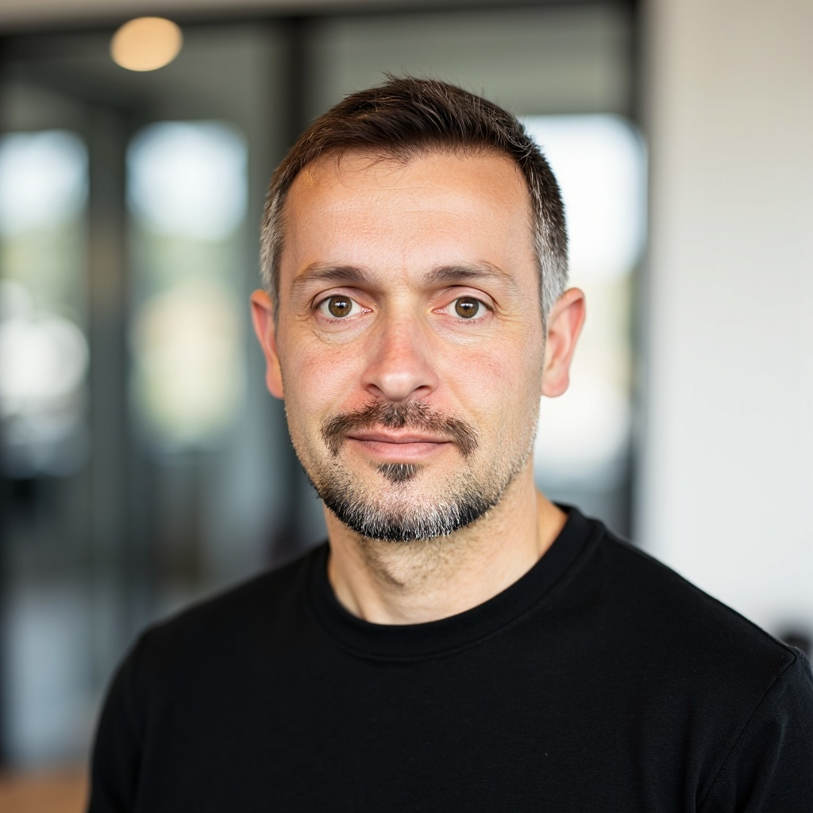

# About

  

    
  

  

    <h2 style="margin-top: 0;">Chaz Hyseni, Ph.D.</h2>
    
<strong>ORISE Postdoctoral Fellow</strong> 
    U.S. Forest Service 
    Aquatic Conservation & Ecology 
    Oxford, Mississippi, USA

    

      <a href="mailto:chaz.hyseni@gmail.com">?? Email</a> | 
      <a href="https://github.com/chazhyseni">?? GitHub</a> | 
      <a href="https://scholar.google.com/citations?user=i-4wi1oAAAAJ">?? Google Scholar</a> |
      <a href="https://orcid.org/0000-0003-2567-8013">?? ORCID</a> |
      <a href="files/cv.pdf">?? CV</a>
    

  

## Research Overview

I am an evolutionary biologist and population geneticist with extensive experience in molecular techniques and statistical analyses, including next-generation sequencing and bioinformatics. I use a multi-disciplinary approach to address questions in ecology and evolution, by adapting methods from spatial and multivariate statistics, as well as machine learning.

I use both empirical data and spatial eco-evolutionary modeling to understand the distribution of genetic variation in natural environments. The modeling component involves new ways to assess the role spatial heterogeneity of environments plays in generating genetic variation and biological diversity at multiple levels of organization, from alleles to communities.

**Timescales of evolution** is a unifying theme of my research. At the historical timescale, I have examined geographic and environmental influences on changes in DNA sequence. At the contemporary timescale, I have investigated how epigenetic mechanisms--specifically, DNA methylation--facilitate rapid responses to human-mediated disturbance, both in forest and urban environments.

## Research Interests

- ?? **Bioinformatics & Computational Biology**
- ?? **Spatial & Landscape Genetics**  
- ?? **Epigenetics & DNA Methylation**
- ?? **Statistical Modeling & Machine Learning**
- ?? **Population Genetics & Phylogeography**
- ??? **Urban Ecology & Conservation**

## Biography

I was born in Germany in 1980, and moved to Kosovo in 1985, where I graduated from high school in 1999. After the [war in Kosovo](https://en.wikipedia.org/wiki/Kosovo_War), I worked for three years as an interpreter for the United Nations Mission in Kosovo.

In 2002, I was admitted to Yale University, and moved to the United States to start college. I received a B.A. in Environmental Studies in 2007. As part of this degree, I did fieldwork on the Galapagos Islands in the summer of 2006, and a year later completed my thesis, *Galapagos giant tortoise conservation on the island of Santa Cruz: morphological and genetic distinctiveness of a newly discovered taxon*, under the supervision of [Dr. Adalgisa Caccone](https://caccone.yale.edu/). Upon graduation, I worked as a research assistant in the lab of Dr. Caccone until 2012. This experience resulted in a long-term involvement in population/landscape genetics projects related to a disease vector, tsetse.

I started my Ph.D. journey in 2012, by enrolling in the Natural Resources program at Cornell University. In January 2014, I left the program at Cornell University and enrolled in the Biological Science program at the University of Mississippi. There, under the mentorship of [Dr. Ryan Garrick](https://rcgarrick.org/), I did research on the [evolutionary history of subterranean termites in the forest ecosystems of the Appalachian Mts.](https://www.proquest.com/openview/91a7574eb4c5bc4fbdb2f49bda9e3f3e/1?pq-origsite=gscholar&cbl=51922&diss=y) and received my Ph.D. in May 2020.

For my first postdoctoral position, I moved back to Europe, and lived for a year in Sweden. I worked with Profs. [Frank Johansson](https://katalog.uu.se/profile/?id=N11-702) and [Jacob Höglund](https://katalog.uu.se/profile/?id=XX3226) in the Department of Ecology and Genetics at Uppsala University. There, I did research on the influence of [urban environments and landscape connectivity](https://github.com/chazhyseni/pond_conn) on aquatic invertebrate biodiversity in urban ponds, as well as (epi-)genetic variation within species.

As of August 2021, I am an [Oak Ridge Institute for Science and Education (ORISE)](https://orise.orau.gov/) postdoctoral fellow at the U.S. Forest Service, where I work with [Dr. Susan Adams](https://www.srs.fs.usda.gov/staff/sadams01) as part of the Aquatic Conservation and Ecology team. This work entails spatial and temporal modeling of stream temperatures aimed at disentangling effects of climate change on diversity of [crayfish communities in Mississippi streams](https://www.srs.fs.usda.gov/crayfish/).
